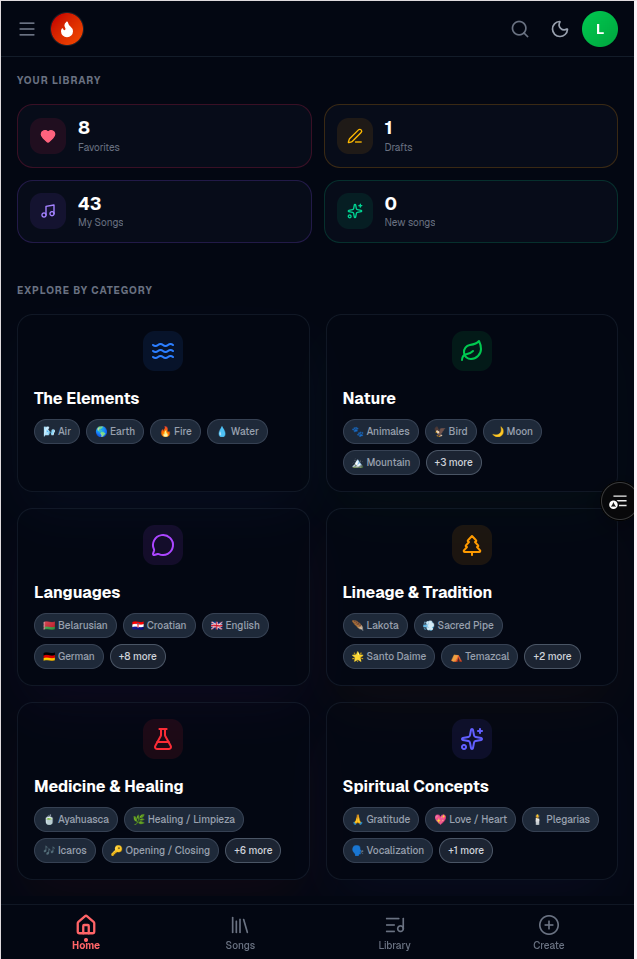
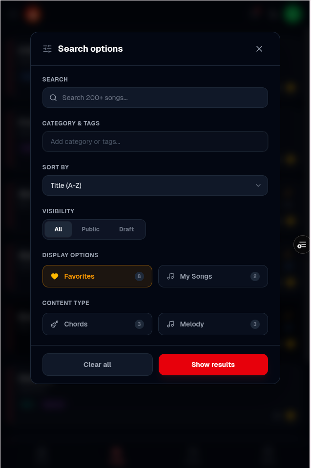
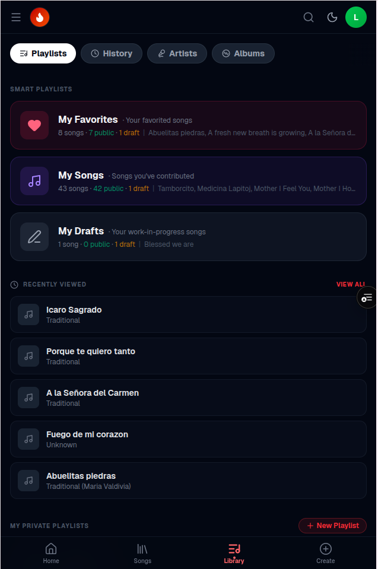
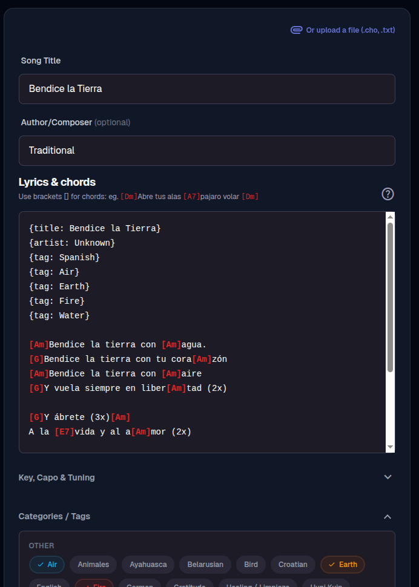
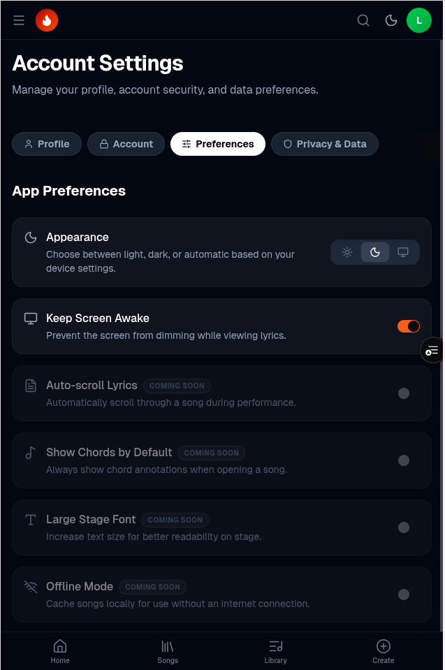

# 🔥 Sacred Fire Songs

> A digital songbook for medicine music ceremonies — ChordPro editing, transposition, and setlist management, built for musicians who play in circle.

[](https://nextjs.org/)
[](https://supabase.com/)
[](https://tailwindcss.com/)
[](https://web.dev/progressive-web-apps/)

**Live app: [app.songbook.rocks](https://app.songbook.rocks/)**

---

## Screenshots

<table>
  <tr>
    <td align="center"><br/><sub>Home — library stats and category browser</sub></td>
    <td align="center"><br/><sub>Search options — filter by category, tags, visibility, and content type</sub></td>
  </tr>
  <tr>
    <td align="center"><br/><sub>Library — smart playlists, recently viewed, and private playlists</sub></td>
    <td align="center"><br/><sub>Song editor — ChordPro notation with live chord highlighting and category tagging</sub></td>
  </tr>
  <tr>
    <td align="center"><br/><sub>Settings — appearance, screen wake lock, and upcoming performance features</sub></td>
    <td></td>
  </tr>
</table>

---

## What it does

Sacred Fire Songs is a collaborative web app for ceremony musicians to store, share, and perform medicine songs. Songs are written in [ChordPro](https://www.chordpro.org/) notation — chords sit above lyrics in a clean, readable format that works on any screen size.

It's designed for **use in ceremony**: large readable text, screen wake lock so the display never sleeps, real-time transposition, and a mobile-first layout that works offline as an installed PWA.

---

## Features

- **ChordPro editor** — full ChordPro notation with live auto-sizing and smart paste from any text source
- **Transposition** — music-theory-aware key shifting (C → G, Am → Em, etc.) powered by ChordSheetJS
- **Playlists / Setlists** — build ordered setlists with drag-and-drop, shareable links, and visibility control
- **Category filtering** — 32 subcategories across 6 groups (Elements, Nature, Language, Lineage, Healing, Spiritual) — see [`docs/design/categories.md`](docs/design/categories.md)
- **Screen Wake Lock** — keeps the screen on during ceremony so songs stay visible
- **Role-based access** — Guest → Member → Gatekeeper → Admin; gatekeepers review and curate the song library
- **PWA** — installable on any phone or tablet; launches in standalone mode with branded splash screen
- **Auth** — email + magic link via Supabase, with onboarding flow

---

## Tech stack

| Layer | Technology |
|---|---|
| Frontend | Next.js 16 (App Router), React 19 |
| Styling | Tailwind CSS v4 |
| ChordPro | [ChordSheetJS](https://github.com/martijnversluis/ChordSheetJS) |
| Backend / DB | Supabase (Postgres + Row-Level Security) |
| Auth | Supabase Auth (email OTP) |
| Data fetching | TanStack Query v5 |
| Animation | Framer Motion |
| Testing | Vitest |
| Deployment | Vercel |

---

## Getting started

```bash
# 1. Clone
git clone https://github.com/your-org/sacred-fire-songs.git
cd sacred-fire-songs

# 2. Install dependencies
npm install

# 3. Set up environment variables
cp .env.example .env.local
# Add your Supabase URL and anon key

# 4. Run locally
npm run dev
```

Open [http://localhost:3000](http://localhost:3000).

---

## Project structure

```
app/          # Next.js App Router pages
components/   # UI components
lib/          # Shared utilities, Supabase clients, ChordPro parsing
supabase/     # Migrations and seed data
docs/
  design/     # DB schema, UI mockups, categories reference
  logbook/    # Epic & user stories, session walkthroughs
  plans/      # Implementation plans
```

---

## Contributing

1. Check [`docs/logbook/epic&user stories.md`](docs/logbook/epic%26user%20stories.md) for open stories
2. Branch from `main`: `feat/userstory-X.X` or `fix/short-description`
3. Run tests: `npm test`
4. Open a PR — title format: `[Story X.X.X] Short description`

Direct commits to `main` are not allowed.
